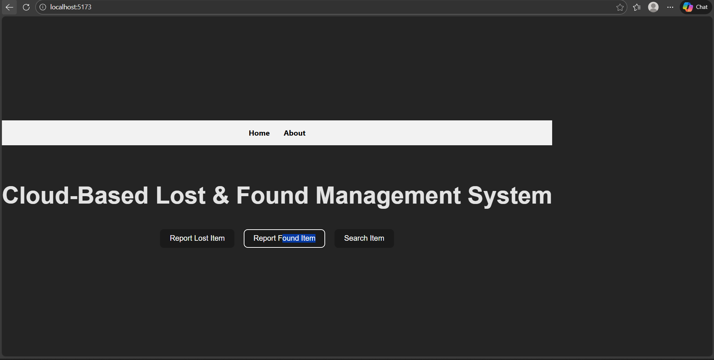

# Experiment–3: Implementing SPA Routing in React

## Aim

To implement **Single Page Application (SPA) routing** in a React application using **React Router**, enabling navigation between components without reloading the page.

---



## Objective

* Understand the concept of SPA routing
* Implement client-side routing using React Router
* Navigate between pages (Home and About) efficiently

---

## Tools & Technologies Used

* React
* Vite
* React Router DOM
* JavaScript (JSX)
* HTML & CSS (minimal styling)

---

## Description

In this experiment, SPA routing is implemented in a React application. Instead of loading new pages from the server, React Router dynamically renders components based on the URL path. This improves performance and provides a smooth user experience.

The application contains two main pages:

* **Home Page**
* **About Page**

Navigation between these pages is handled using React Router without refreshing the browser.

---

## Steps to Implement SPA Routing

### 1. Create React App using Vite

```bash
npm create vite@latest experiment-3
cd experiment-3
npm install
npm run dev
```

---

### 2. Install React Router

```bash
npm install react-router-dom
```

---

### 3. Create Components

* `Home.jsx`
* `About.jsx`

Each component returns JSX content for its respective page.

---

### 4. Configure Routing in App.jsx

React Router components such as `BrowserRouter`, `Routes`, `Route`, and `Link` are used to define navigation paths.

* `/` → Home Component
* `/about` → About Component

---

## Output

* The application runs as a **Single Page Application**
* Navigation between Home and About pages occurs without page reload
* URL updates dynamically

---

## Advantages of SPA Routing

* Faster navigation
* Better user experience
* Reduced server load
* Efficient component rendering

---

## Result

Thus, **SPA routing using React Router** was successfully implemented in a React application.

---

## Conclusion

This experiment demonstrates how client-side routing works in React. By using React Router, we can build scalable and efficient Single Page Applications with smooth navigation.
